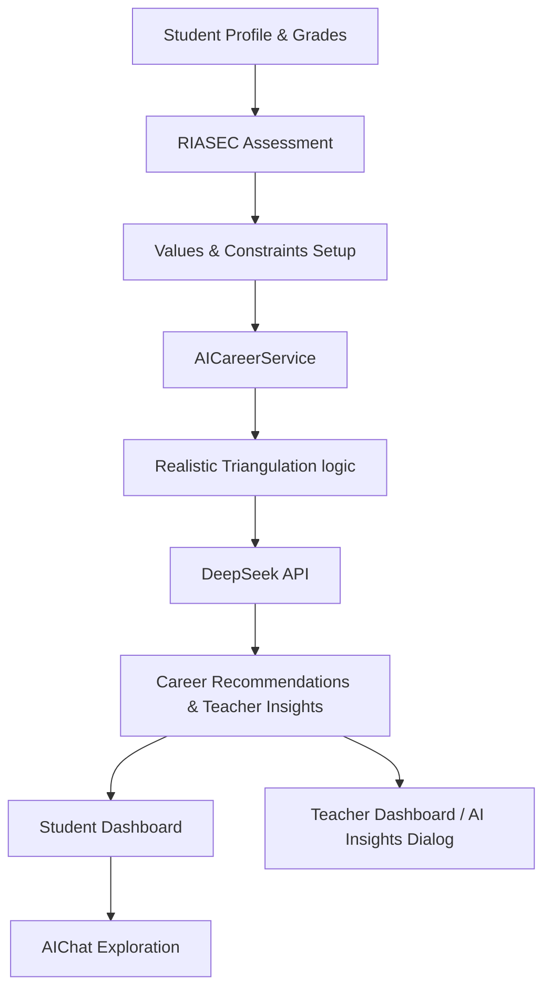

# Career Guidance Flow: System Connectivity

This document outlines how the various components of the CareerPath AI platform connect to provide a seamless career guidance experience for students and teachers.

## 1. Data Collection Layer
The journey begins with comprehensive data collection through the **Discovery Assessment**:
- **RIASEC Assessment**: Captures personality traits through interactive activity selection.
- **Values & Constraints**: Captured in Step 4 of the profile setup, identifying what students find meaningful and what limits their choices (financial, geographical, etc).
- **Academic Sync**: Fetches student grades and performance trends from the `student_grades` table.

## 2. Processing Layer (The "Triangulation" Core)
The system uses **Realistic Triangulation Logic** to synthesize disparate data points:
- **Input**: User Profile + Assessment Results + Academic Performance + Kenyan Market Trends.
- **Service**: `AICareerService` (`src/lib/ai-service.ts`) orchestrates the AI calls to DeepSeek-V3.
- **Caching**: `AICacheService` (`src/lib/ai-cache-service.ts`) ensures that complex recommendations are stored and served efficiently, reducing API latency and costs.

## 3. Presentation Layer
- **Student Dashboard**: Displays the "Personality Radar," "Actionability Meter," and 3-pillar career matches.
- **Teacher Dashboard**: Provides "AI Insights" through the `StudentInsightDialog`. Teachers see pedagogical strategies tailored to the student's unique triangulation.
- **AI Chat**: A dynamic, contextual conversation interface that allows students to dive deeper into specific career fields using the same "triangulated" context.

## 4. Connectivity Diagram

## 5. Summary of Impacts
- **Students** get actionable, realistic advice that factors in their actual environment.
- **Teachers** get tactical mentorship tips to support students effectively.
- **System** remains performant through a robust caching layer.
